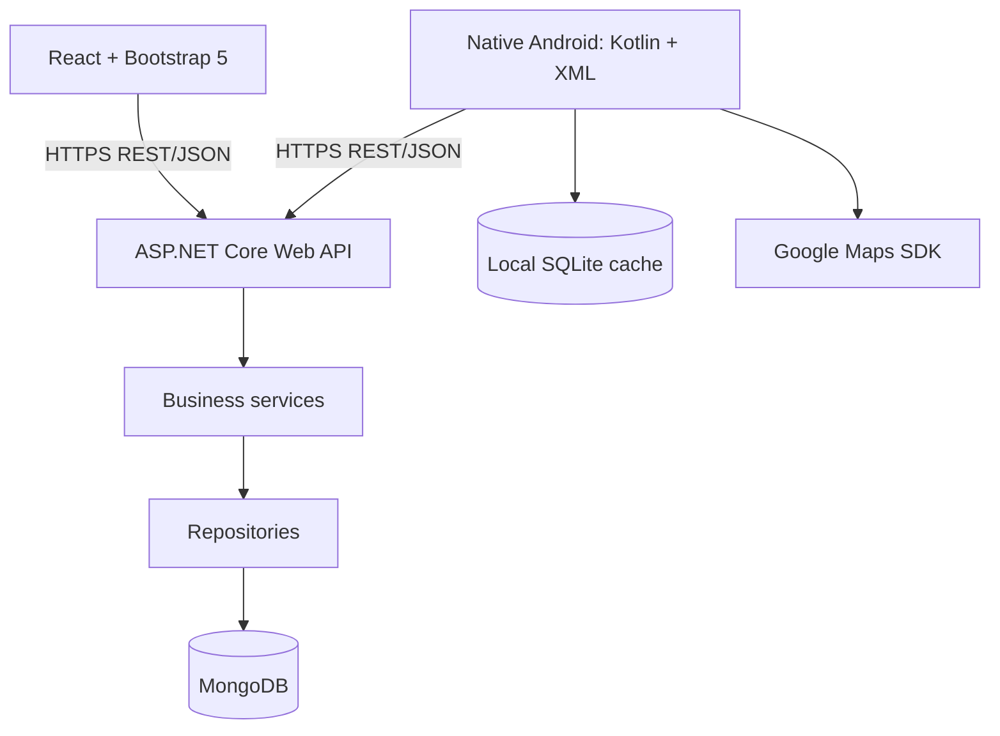

# Solution architecture

## System boundaries

Use a fat service architecture in one API project initially. Controllers handle HTTP input/output and invoke services. Services enforce authorization context, ownership, state transitions, reservation policy, and transaction coordination. Repositories perform database access; atomic updates and transactions support service decisions. Neither client connects to MongoDB or independently decides whether a booking is permitted.

## Backend responsibilities

| Directory | Responsibility |
| --- | --- |
| Controllers | REST endpoints, validated DTO input, HTTP results |
| Models | Internal MongoDB documents and domain status definitions |
| DTOs | Explicit request/response contracts; never expose password hashes |
| Services | All business rules, identity/ownership checks, orchestration |
| Repositories | Async MongoDB access, indexes, conditional writes |
| Configuration | Typed settings and dependency registration |
| Middleware | Global exception handling and structured error responses |
| Helpers | Small shared technical utilities; no hidden business rules |
| tests/SmartSolarMicrogrid.Api.Tests | Future service, authorization, and database integration tests |

Use dependency injection and async I/O. Prefer feature-specific services (auth, users/prosumers, stations, slots, reservations, QR, dashboards) over one oversized service. Introduce interfaces where they provide a useful dependency boundary; avoid additional projects without a concrete need.

## Clients

React uses Bootstrap 5, React Router, and Axios. Future code groups pages, reusable components, API access, and authentication state. Role-aware navigation improves usability; API authorization remains mandatory.

Android uses Kotlin, XML layouts, Retrofit, SQLiteOpenHelper, Google Maps SDK, and a camera QR scanning library. Future packages separate UI, API DTOs/client, and local persistence. SQLite may cache profile display fields and station reference data with freshness timestamps. It must not store passwords, authorize offline reservations, or treat cached availability as authoritative. Decide secure token storage during authentication implementation rather than putting bearer tokens in plaintext SQLite.

## Roles and access

| Role | Clients | Responsibilities |
| --- | --- | --- |
| BACKOFFICE | Web | Manage staff/prosumers, approve accounts, reactivate prosumers, manage stations/schedules, view reservations |
| GRID_OPERATOR | Web and Android | Operational views, availability maintenance, permitted cancellation assistance, server-verified QR completion |
| PROSUMER | Primarily Android | Register/login, own profile/deactivation request, nearby stations, own bookings/search/history/dashboard, approved booking QR |

JWTs carry identity and role claims. Protected endpoints enforce role policies; services also enforce ownership using authenticated identity. Do not trust a client-supplied role, NIC, or user ID as authorization. Account status must be checked server-side so deactivation cannot be bypassed using an existing session. Only Backoffice may reactivate a deactivated prosumer. Never return password hashes or log credentials/tokens.

## Server business rule checklist

1. Reservations must be in the future and no more than seven days ahead.
2. Updating a reservation requires at least twelve hours before its scheduled time.
3. Cancelling a reservation requires at least twelve hours before its scheduled time.
4. Station deactivation is blocked by active/future reservations.
5. Only Backoffice may reactivate a deactivated prosumer.
6. Prosumer NIC is unique and is the business identifier.
7. Prosumers may edit or request deactivation only for their own account.
8. Operators never inherit Backoffice administration permissions.
9. QR verification and transfer completion always consult the central API.
10. Cancelled, completed, rejected, or invalid QR transactions cannot be completed again.
11. The API checks station availability and slot capacity before reserving/approving energy.
12. Capacity allocation and state transitions must resist races and double booking.

Store timestamps in UTC, display in the user's timezone, and inject a server clock for boundary tests. Exactly twelve hours meets the notice requirement; exactly seven days meets the upper booking limit. Updates validate both the existing booking notice and the proposed date/availability.

Before Phase 8, settle the approval workflow (including whether pending bookings hold capacity), station active-reservation semantics, and capacity units. Proposed units are kWh for requested energy and slot energy capacity, with battery slot counts kept separate. Cancellation assistance must not implicitly bypass notice rules. Record these decisions before implementing transitions.

Use conditional capacity updates, unique indexes, and MongoDB transactions where reservation and capacity documents must change together. A replica set is required for that transaction design. QR completion uses a conditional APPROVED-to-COMPLETED transition, records operator/time, and allows only one successful completion even under concurrent requests. Verification alone does not consume a reservation.

## API contracts and errors

Planned route groups: `/api/auth`, `/api/users`, `/api/prosumers`, `/api/stations`, `/api/slots`, `/api/reservations`, and `/api/operator`. Publish OpenAPI documentation as endpoints are implemented. Use DTOs, consistent validation, paginated list/search results, and meaningful 200/201/400/401/403/404/409 responses. Use a consistent Problem Details error shape with validation details and a trace identifier; unexpected failures return a safe 500 response and are logged server-side.

The API supplies dashboard values, searchable booking views, nearby coordinates, and secure opaque QR tokens. Clients display understandable errors for offline/timeouts, expired sessions, forbidden actions, unavailable capacity, business restrictions, and invalid/reused QR codes.

## Report and deployment plan

Retain architecture/use-case/DFD material, data model, API/security decisions, business rules, test evidence, screenshots, contribution records, challenges, references, and deployment instructions in `docs/` as features are completed. IIS hosts the published API over HTTPS; browser origins are explicitly configured. MongoDB access and server secrets remain server-side. Deployment procedures are deferred to Phase 24.
